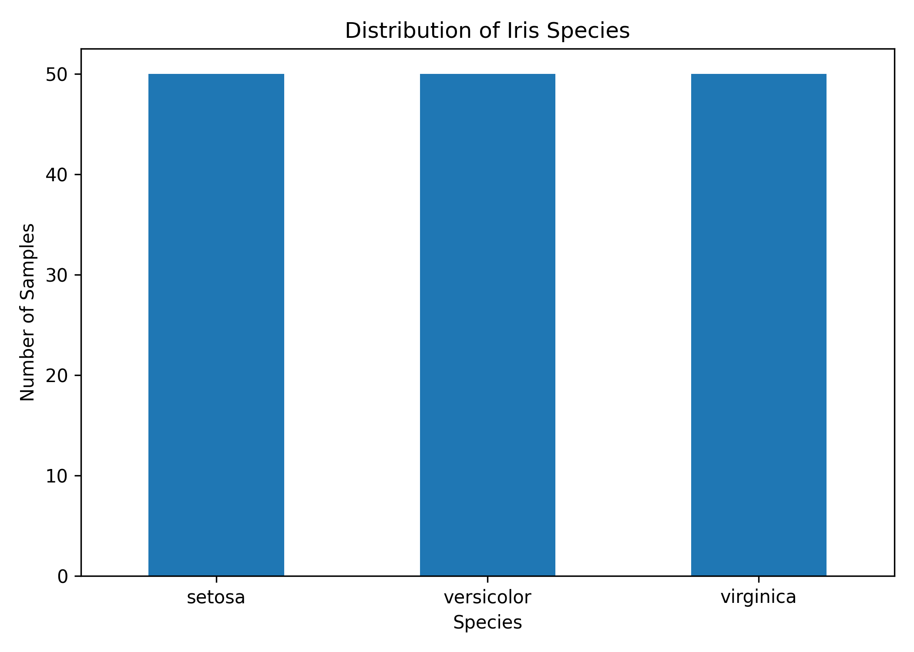
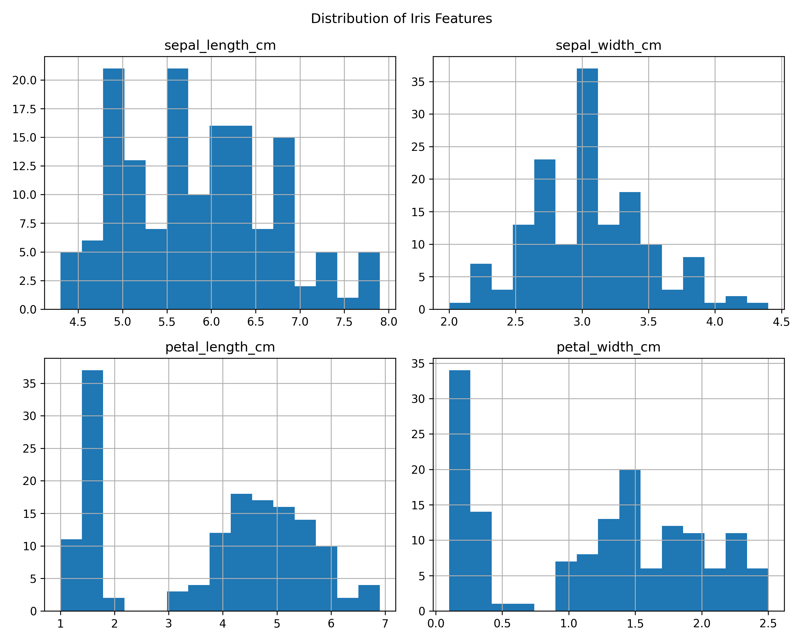
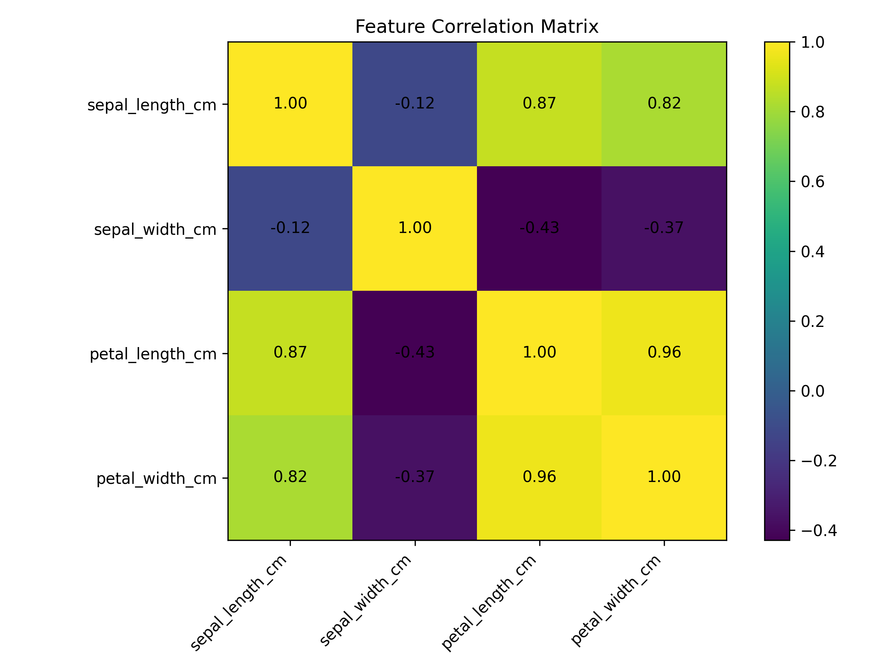
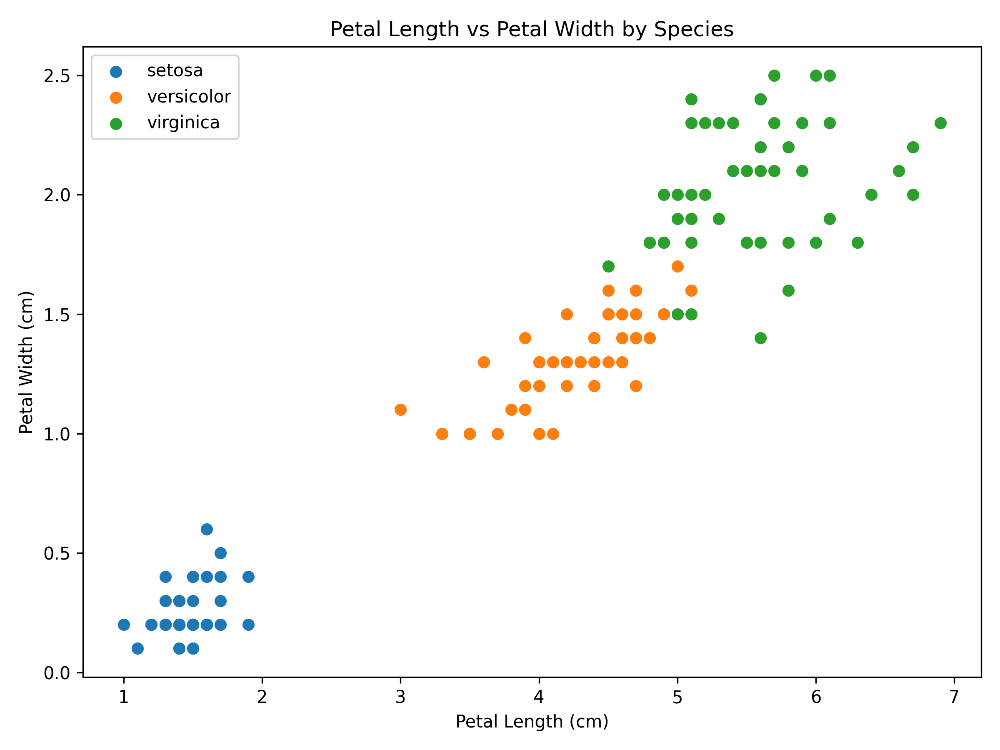
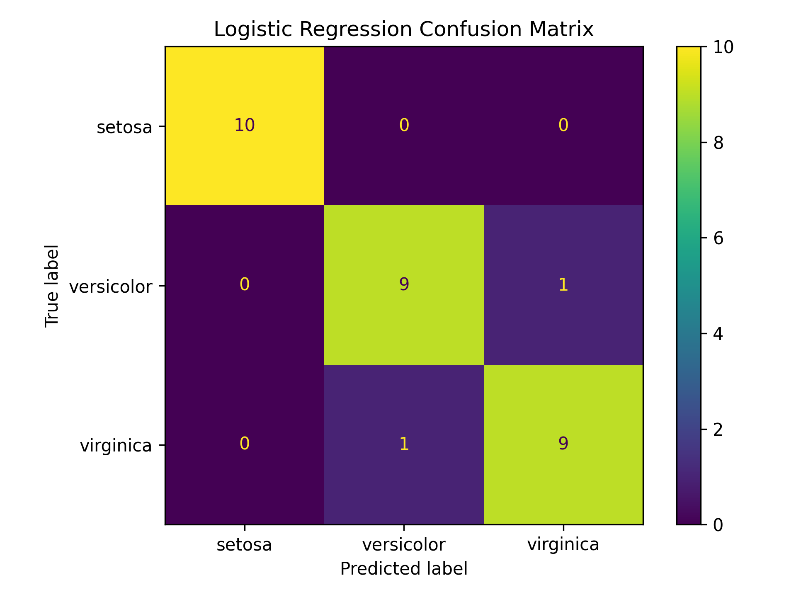
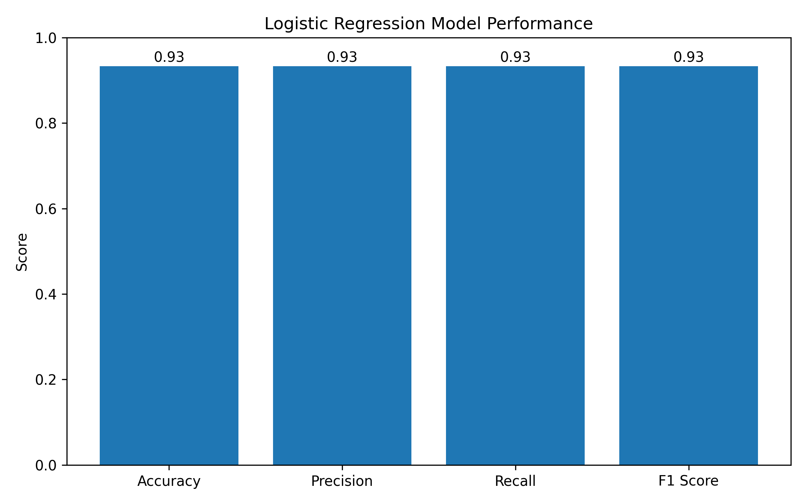

# 🌸 Iris Species Analysis and Classification

## YuvaIntern 5-Week Data Science with Python Project

A complete end-to-end Data Science project developed as part of the **YuvaIntern Data Science with Python Internship**.

This project analyzes the classic Iris dataset and builds a machine learning classification model to predict Iris flower species using sepal and petal measurements.

The project covers the complete data science workflow:

**Data Acquisition → Data Cleaning → EDA → Visualization → Statistical Analysis → Machine Learning → Model Evaluation → Error Analysis → Practical Insights**

---

# 📌 Project Overview

The objective of this project is to analyze measurements of Iris flowers and classify them into three species:

- 🌱 Iris Setosa
- 🌸 Iris Versicolor
- 🌺 Iris Virginica

The analysis combines exploratory data analysis, statistical hypothesis testing, visualization, and machine learning to understand the relationships between flower measurements and species classification.

---

# 🎯 Project Objectives

The major objectives of this project are:

1. Acquire the Iris dataset using Scikit-learn.
2. Inspect and clean the dataset.
3. Perform exploratory data analysis.
4. Analyze feature distributions and relationships.
5. Create meaningful data visualizations.
6. Perform statistical hypothesis testing.
7. Build a Logistic Regression classification model.
8. Evaluate the model using multiple performance metrics.
9. Analyze classification errors.
10. Check for possible overfitting and underfitting.
11. Identify practical applications and business implications.
12. Define future improvements for the project.

---

# 🗂️ Project Structure

```text
YuvaIntern-Data-Science-with-Python/
│
├── README.md
├── final_project.py
├── requirements.txt
│
├── species_distribution.png
├── feature_distributions.png
├── correlation_matrix.png
├── petal_length_vs_width.png
├── confusion_matrix.png
└── model_performance.png
```

---

# 📊 Dataset

The project uses the **Iris dataset** available through Scikit-learn.

The dataset contains measurements of three Iris species.

| Property | Value |
|---|---:|
| Total observations | 150 |
| Features | 4 |
| Species | 3 |
| Samples per species | 50 |
| Missing values | 0 |
| Duplicate rows detected | 1 |

## Features

The four numerical features are:

- Sepal Length (cm)
- Sepal Width (cm)
- Petal Length (cm)
- Petal Width (cm)

## Target Variable

The target variable contains three classes:

```text
setosa
versicolor
virginica
```

---

# 🔬 Methodology

The project follows a structured five-week data science methodology.

```text
                    Iris Dataset
                         │
                         ▼
                Data Acquisition
                         │
                         ▼
                 Data Inspection
                         │
                         ▼
                 Data Cleaning
                         │
                         ▼
           Exploratory Data Analysis
                         │
                         ▼
                Data Visualization
                         │
                         ▼
           Statistical Hypothesis Testing
                         │
                         ▼
                  Train/Test Split
                         │
                         ▼
                  Feature Scaling
                         │
                         ▼
                Logistic Regression
                         │
                         ▼
                 Model Evaluation
                         │
                         ▼
                   Error Analysis
                         │
                         ▼
              Practical Recommendations
```

---

# 📅 Week 1 — Data Acquisition, Cleaning and EDA

## 1. Data Acquisition

The Iris dataset is loaded using Scikit-learn:

```python
from sklearn.datasets import load_iris

iris = load_iris(as_frame=True)
df = iris.frame.copy()
```

The dataset is then converted into a Pandas DataFrame.

The columns are renamed for better readability:

```python
df.columns = [
    "sepal_length_cm",
    "sepal_width_cm",
    "petal_length_cm",
    "petal_width_cm",
    "species_id"
]
```

The numerical target values are converted into species names:

```python
df["species"] = df["species_id"].map(
    dict(enumerate(iris.target_names))
)

df.drop(columns=["species_id"], inplace=True)
```

---

## 2. Data Quality Checks

The following checks were performed:

- Dataset shape
- Missing values
- Duplicate rows
- Descriptive statistics
- Species distribution

Example:

```python
print(df.shape)
print(df.isna().sum())
print(df.duplicated().sum())
print(df.describe())
print(df["species"].value_counts())
```

### Data Quality Findings

- Dataset contains **150 observations**.
- There are **4 numerical features**.
- There are **3 Iris species**.
- No missing values were detected.
- **1 duplicate row was detected**.

The duplicate was identified during the data-quality check and is reported transparently in the analysis.

---

# 📈 Week 2 — Data Visualization and Storytelling

Multiple visualizations were created to understand the structure and relationships within the dataset.

---

## 1. Species Distribution

The dataset contains 50 observations for each Iris species.

```python
species_counts = df["species"].value_counts()

species_counts.plot(kind="bar")

plt.title("Distribution of Iris Species")
plt.xlabel("Species")
plt.ylabel("Number of Samples")
```

### Visualization



### Interpretation

The dataset is evenly distributed across the three species, with 50 observations per species.

---

## 2. Feature Distributions

Histograms were created for all four numerical features.

```python
features = [
    "sepal_length_cm",
    "sepal_width_cm",
    "petal_length_cm",
    "petal_width_cm"
]

df[features].hist(figsize=(10, 8), bins=15)

plt.suptitle("Distribution of Iris Features")
```

### Visualization



### Interpretation

The feature distributions show differences in the measurement ranges of the Iris species.

Petal length and petal width show particularly useful separation patterns.

---

## 3. Feature Correlation

A correlation matrix was calculated to understand relationships between numerical features.

```python
correlation_matrix = df[features].corr()

print(correlation_matrix)
```

### Visualization



### Key Observations

The analysis shows strong positive relationships between:

- Sepal length and petal length
- Sepal length and petal width
- Petal length and petal width

Petal length and petal width have a particularly strong positive correlation.

---

## 4. Petal Length vs Petal Width

A scatter plot was created to visualize the relationship between petal length and petal width for each species.

```python
for species in iris.target_names:

    subset = df[df["species"] == species]

    plt.scatter(
        subset["petal_length_cm"],
        subset["petal_width_cm"],
        label=species
    )
```

### Visualization



### Interpretation

The visualization shows clear separation of Setosa from the other species.

Versicolor and Virginica are closer to each other and show some overlap, which helps explain the classification errors produced by the machine learning model.

---

# 🧪 Week 3 — Statistical Analysis and Hypothesis Testing

Statistical hypothesis testing was used to determine whether observed differences in petal measurements were statistically significant.

A significance level of:

```text
α = 0.05
```

was used.

---

# 1. Welch's Independent Samples T-Test

Welch's t-test was performed to compare petal length between:

- Iris Versicolor
- Iris Virginica

## Null Hypothesis (H₀)

The mean petal length of Versicolor and Virginica is equal.

## Alternative Hypothesis (H₁)

The mean petal length of Versicolor and Virginica is different.

## Methodology

Welch's t-test was selected because it does not require the two groups to have equal variances.

```python
t_stat, p_value = stats.ttest_ind(
    versicolor,
    virginica,
    equal_var=False
)
```

## Result

```text
T-statistic ≈ -12.6038
P-value ≈ 4.90 × 10⁻²²
```

Since:

```text
p-value < 0.05
```

the null hypothesis is rejected.

### Conclusion

There is a statistically significant difference in petal length between Iris Versicolor and Iris Virginica.

---

# 2. One-Way ANOVA

A one-way ANOVA was performed to compare petal length across all three Iris species.

## Null Hypothesis (H₀)

All three species have the same mean petal length.

## Alternative Hypothesis (H₁)

At least one species has a different mean petal length.

```python
groups = [
    df[df["species"] == species]["petal_length_cm"]
    for species in iris.target_names
]

f_stat, anova_p = stats.f_oneway(*groups)
```

## Result

```text
F-statistic ≈ 1180.1612
P-value ≈ 2.86 × 10⁻⁹¹
```

Since:

```text
p-value < 0.05
```

the null hypothesis is rejected.

### Conclusion

There is strong statistical evidence that petal length differs across the three Iris species.

---

# 🤖 Week 4 — Machine Learning Model Development

## Model Selection

A **Logistic Regression** classifier was selected as the baseline machine learning model.

Logistic Regression is appropriate for this classification problem because the target contains three categorical classes.

---

# 🔀 Train-Test Split

The dataset was divided into training and testing sets.

```python
X_train, X_test, y_train, y_test = train_test_split(
    X,
    y,
    test_size=0.20,
    random_state=42,
    stratify=y
)
```

### Split Used

| Dataset | Samples |
|---|---:|
| Training set | 120 |
| Testing set | 30 |

The `stratify=y` parameter was used to maintain the class distribution across training and testing datasets.

---

# ⚙️ Machine Learning Pipeline

A Scikit-learn Pipeline was used to combine feature scaling and classification.

```python
model = Pipeline([
    (
        "scaler",
        StandardScaler()
    ),
    (
        "classifier",
        LogisticRegression(
            max_iter=1000,
            random_state=42
        )
    )
])
```

## Pipeline Steps

### Step 1 — StandardScaler

The numerical features are standardized so that differences in feature scale do not disproportionately affect the model.

### Step 2 — Logistic Regression

The scaled features are provided to Logistic Regression for multi-class classification.

### Step 3 — Model Training

```python
model.fit(X_train, y_train)
```

### Step 4 — Prediction

```python
y_test_pred = model.predict(X_test)
```

---

# 📊 Model Evaluation

The trained model was evaluated using:

- Accuracy
- Precision
- Recall
- F1 Score
- Classification Report
- Confusion Matrix

```python
accuracy = accuracy_score(
    y_test,
    y_test_pred
)

precision = precision_score(
    y_test,
    y_test_pred,
    average="weighted"
)

recall = recall_score(
    y_test,
    y_test_pred,
    average="weighted"
)

f1 = f1_score(
    y_test,
    y_test_pred,
    average="weighted"
)
```

---

# 🏆 Final Model Results

The latest execution of the project produced the following results:

| Metric | Result |
|---|---:|
| Accuracy | **93.33%** |
| Precision | **93.33%** |
| Recall | **93.33%** |
| F1 Score | **93.33%** |

The model correctly classified **28 out of 30 test samples**.

---

# 📋 Classification Report

The model achieved the following class-level performance:

| Species | Precision | Recall | F1 Score |
|---|---:|---:|---:|
| Setosa | 1.00 | 1.00 | 1.00 |
| Versicolor | 0.90 | 0.90 | 0.90 |
| Virginica | 0.90 | 0.90 | 0.90 |

The results show that Setosa was classified perfectly in the test split, while Versicolor and Virginica had minor confusion.

---

# 🔲 Confusion Matrix

The confusion matrix provides a detailed view of correct and incorrect predictions.



### Confusion Matrix Results

```text
                 Predicted
              Setosa  Versicolor  Virginica

Setosa           10        0          0

Versicolor        0        9          1

Virginica         0        1          9
```

### Interpretation

- **10/10 Setosa** samples were correctly classified.
- **9/10 Versicolor** samples were correctly classified.
- **9/10 Virginica** samples were correctly classified.
- One Versicolor sample was predicted as Virginica.
- One Virginica sample was predicted as Versicolor.

The errors occurred only between Versicolor and Virginica.

---

# 📈 Model Performance Visualization

The following chart compares Accuracy, Precision, Recall and F1 Score.



All four evaluation metrics are approximately **93.33%**, indicating consistent model performance.

---

# 🔍 Error Analysis

Error analysis was performed by comparing actual and predicted labels.

```python
error_analysis = X_test.copy()

error_analysis["Actual"] = y_test
error_analysis["Predicted"] = y_test_pred

misclassified = error_analysis[
    error_analysis["Actual"] != error_analysis["Predicted"]
]
```

## Results

The model misclassified:

```text
2 out of 30 test samples
```

The errors were:

| Actual Species | Predicted Species |
|---|---|
| Virginica | Versicolor |
| Versicolor | Virginica |

### Detailed Observation

The two misclassified observations had measurements that were relatively close to the overlapping region between Versicolor and Virginica.

This demonstrates why error analysis is important: overall accuracy shows how well the model performs, while individual errors help explain **where and why** the model struggles.

### Main Finding

Setosa is much easier to distinguish from the other two species.

Versicolor and Virginica have more similar measurements, particularly in their petal characteristics, which increases the possibility of classification confusion.

---

# 🧠 Overfitting and Underfitting Analysis

Training and testing accuracy were compared to assess model generalization.

```python
train_accuracy = accuracy_score(
    y_train,
    y_train_pred
)

test_accuracy = accuracy_score(
    y_test,
    y_test_pred
)

accuracy_gap = train_accuracy - test_accuracy
```

## Actual Results

| Metric | Result |
|---|---:|
| Training Accuracy | **95.83%** |
| Testing Accuracy | **93.33%** |
| Accuracy Gap | **2.50 percentage points** |

### Interpretation

The training accuracy is slightly higher than the testing accuracy, which is expected in many machine learning problems.

The difference is only **2.50 percentage points**, indicating that the model maintains strong performance on unseen test data.

There is **no strong evidence of overfitting** on this test split.

The model also does not show signs of underfitting because both training and testing performance are high.

### Generalization

The small gap between training and testing accuracy suggests that the model generalizes reasonably well for this dataset and split.

---

# 💡 Key Data Science Insights

The analysis produced several important findings.

### 1. Petal measurements are highly informative

Petal length and petal width show strong relationships with other features and provide useful information for species classification.

### 2. Setosa is easier to classify

The visualization and confusion matrix show that Setosa is clearly separated from the other species.

### 3. Versicolor and Virginica are more difficult to distinguish

These species have overlapping measurements, resulting in the two observed classification errors.

### 4. Statistical testing supports the visual findings

Both Welch's t-test and one-way ANOVA found statistically significant differences in petal length.

### 5. Logistic Regression provides a strong baseline

The model achieved:

**93.33% Accuracy, Precision, Recall and F1 Score**

on the test set.

---

# 💼 Practical and Business Implications

Although the Iris dataset is primarily educational, the methodology demonstrated in this project can be applied to real-world classification problems.

## 🌱 Automated Plant Identification

A classification model could help identify plant species using measurable characteristics.

## 🔬 Botanical Research

Statistical analysis can help researchers identify meaningful differences between plant species.

## 🤖 Automated Classification Systems

Machine learning can automate repetitive classification tasks when reliable features are available.

## 📚 Education and Training

The project demonstrates a complete practical machine learning workflow from raw data to model evaluation.

---

# 🌍 Broader Real-World Applications

The same workflow can be adapted to problems such as:

- Customer classification
- Customer churn prediction
- Fraud detection
- Product categorization
- Quality-control systems
- Medical classification
- Image classification
- Recommendation systems

The general approach remains:

**Collect Data → Clean Data → Analyze → Visualize → Test → Train → Evaluate → Improve**

---

# 🚀 Future Scope

Several improvements can be implemented in future versions.

## 1. Compare Multiple Machine Learning Algorithms

The Logistic Regression baseline can be compared with:

- Decision Tree
- Random Forest
- K-Nearest Neighbors
- Support Vector Machine

This would help determine which algorithm performs best.

## 2. Cross-Validation

K-Fold Cross-Validation can provide a more robust estimate of model performance than relying on a single train-test split.

## 3. Hyperparameter Tuning

Grid Search or Randomized Search can be used to optimize model parameters.

## 4. Feature Selection

Feature selection techniques can identify which measurements contribute most strongly to classification.

## 5. Model Explainability

Future versions could include model interpretation techniques to understand how individual features influence predictions.

## 6. Model Deployment

The trained model could be deployed using:

- Streamlit
- Flask
- FastAPI

A web interface could allow users to enter flower measurements and receive a predicted Iris species.

## 7. Larger Real-World Datasets

The methodology could be tested on larger and more complex botanical datasets to evaluate scalability.

---

# 🛠️ Technologies Used

| Technology | Purpose |
|---|---|
| Python | Programming and analysis |
| Pandas | Data manipulation |
| NumPy | Numerical computing |
| SciPy | Statistical analysis |
| Matplotlib | Data visualization |
| Scikit-learn | Machine learning |

---

# 📦 Installation and Usage

## Clone the Repository

```bash
git clone https://github.com/udai33/YuvaIntern-Data-Science-with-Python.git
```

## Navigate to the Project

```bash
cd YuvaIntern-Data-Science-with-Python
```

## Install Dependencies

```bash
pip install -r requirements.txt
```

## Run the Project

```bash
python final_project.py
```

Running the Python script performs the complete workflow and generates the visualization files.

---

# 📁 Generated Visualizations

The project generates the following visualization files:

```text
species_distribution.png
feature_distributions.png
correlation_matrix.png
petal_length_vs_width.png
confusion_matrix.png
model_performance.png
```

These visualizations are included in this repository and displayed throughout this README.

---

# 📊 Project Results Summary

| Category | Result |
|---|---|
| Dataset Size | 150 observations |
| Features | 4 |
| Species | 3 |
| Missing Values | 0 |
| Duplicate Rows Detected | 1 |
| Training Samples | 120 |
| Testing Samples | 30 |
| Training Accuracy | 95.83% |
| Testing Accuracy | 93.33% |
| Accuracy Gap | 2.50 percentage points |
| Precision | 93.33% |
| Recall | 93.33% |
| F1 Score | 93.33% |
| Misclassified Samples | 2 |

---

# 🏆 Final Conclusion

This project demonstrates a complete five-week Data Science workflow using Python.

The analysis began with data acquisition and quality checks, followed by explorato
